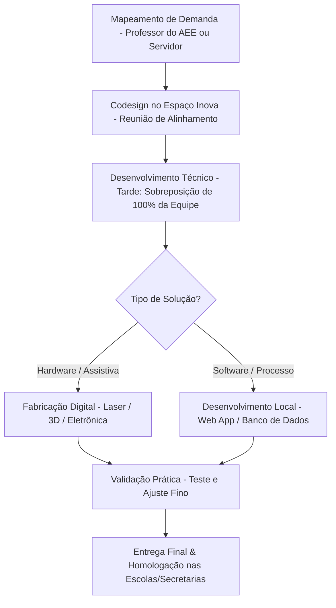

# 💡 Espaço Inova Vinhedo
### Laboratório Maker Municipal & Desenvolvimento Ágil de Soluções Públicas

---

> *"Transformando ideias em soluções reais para a rede municipal, reduzindo custos burocráticos e promovendo a inclusão escolar de forma personalizada e ágil."*

---

## 🎯 Proposta de Valor

O **Espaço Inova Vinhedo** é uma política pública integrada que une um **laboratório de fabricação digital (FabLab)** a uma **equipe ágil de servidores públicos** voltada para o desenvolvimento de soluções locais para o município de Vinhedo/SP. 

O projeto soluciona dois grandes gargalos da gestão pública:
1.  **Kits Didáticos e Recursos de Apoio Escolar:** Criação de kits de ciências e matemática sob medida para as escolas públicas (compensando a ausência de laboratórios físicos) e produção ágil de objetos escolares auxiliares não médicos para inclusão (como engrossadores de escrita e acionadores).
2.  **TI Local Ágil:** Substituição de contratos burocráticos e licitações demoradas de software pelo desenvolvimento interno de pequenos aplicativos e automações para as secretarias.

---

## 📊 Dashboard de Impacto Estimado (Economicidade)

Ao internalizar o design e a fabricação de recursos didáticos e softwares, o projeto inverte a lógica de custos do município:

| Métrica | Cenário Tradicional (Contratos/Licitações) | Modelo Espaço Inova Vinhedo | Impacto Gerado |
| :--- | :---: | :---: | :---: |
| ⏱️ **Lead Time de Entrega** | 6 a 12 meses (processo licitatório) | **15 dias úteis** (desenvolvimento ágil) | **-90% de espera** |
| 💻 **Pequenos Aplicativos de TI** | R$ 60.000,00 a R$ 130.000,00 / licença | **R$ 0,00** (servidor local de TI) | **Evitação de custo** |
| 🎒 **Kits Didáticos / Apoio (AEE)** | R$ 450,00 por kit didático comercial | **R$ 35,00** (insumo de fabricação MDF/3D) | **-92% de economia unitária** |
| 💸 **Balanço Financeiro (Ano 1)** | Desembolso recorrente e engessado | **Retorno líquido de +R$ 99.600,00** | **Autossustentável** |

---

## ⚙️ Fluxo Operacional Maker & Programação

O laboratório opera em ciclos ágeis centrados nas demandas das escolas e secretarias municipais:

---

## 📂 Portfólio de Documentação Estratégica

Este repositório está organizado de forma a oferecer uma visão completa e aprofundada da modelagem técnica, econômica, pedagógica e regulatória do projeto. Explore as seções detalhadas abaixo:

*   📖 **[Plano de Ação Estruturado](file:///Users/diegozolhos/Projects/ESPACO_INOVA_VINHEDO/plano_de_acao.md):** Fases de implantação, diretrizes do espaço físico, governança intersecretarial, **oficinas e projetos de longa duração do AEE**, campanhas de engajamento escolar (HTPCs) e o fluxo jurídico e fiscal de **logística reversa** com indústrias locais (Selo Empresa Parceira da Inclusão).
*   💰 **[Modelagem Financeira e Recursos Humanos](file:///Users/diegozolhos/Projects/ESPACO_INOVA_VINHEDO/modelo_financeiro_custos.md):** CAPEX de montagem (R$ 129.100,00), OPEX de custeio (R$ 62.800/ano) e a escala de revezamento de 4 servidores baseada no quadro atual da prefeitura, otimizando o horário de sobreposição produtiva.
*   📚 **[Fundamentação Acadêmica e Métricas de Impacto](file:///Users/diegozolhos/Projects/ESPACO_INOVA_VINHEDO/revisao_literatura_metricas.md):** Estudos de caso e referências científicas sobre FabLabs e tecnologia assistiva. Define KPIs quantitativos de processo e **indicadores qualitativos integrados ao PEI (Plano de Ensino Individualizado)** para monitoramento de longo prazo.
*   🔒 **[TI, Segurança e LGPD](file:///Users/diegozolhos/Projects/ESPACO_INOVA_VINHEDO/arquitetura_seguranca_lgpd.md):** Governança de dados pessoais e de saúde de menores (laudos do AEE), regras de hospedagem segura em datacenter municipal, modelos de Termos de Consentimento (TCLE) e protocolo de anonimização pública.
*   👥 **[Mapeamento de Personas e Jornadas](file:///Users/diegozolhos/Projects/ESPACO_INOVA_VINHEDO/jornadas_usuarios.md):** Humanização da política por meio de perfis reais (professora do AEE, aluno assistido por adaptador escolar em impressão 3D e servidor de TI local) e a jornada detalhada de seus pontos de contato com o laboratório.
*   🛡️ **[Análise de Vulnerabilidades e Riscos](file:///Users/diegozolhos/Projects/ESPACO_INOVA_VINHEDO/vulnerabilidades_riscos.md):** Mapeamento e estratégias de mitigação ("ataques adversariais") contra descontinuidade política, turnover de pessoal técnico, estrangulamento de insumos e barreiras pedagógicas de adoção docente.
*   🤝 **[Financiamento e Economia de Contratos](file:///Users/diegozolhos/Projects/ESPACO_INOVA_VINHEDO/analise_financiamento_economia.md):** Captação de fomento externo (FINEP, FAPESP, BNDES, SEBRAE), uso do CPSI (Start Vinhedo) e estudo completo de economicidade e retorno do investimento (payback no primeiro ano).
*   📅 **[Cronograma Detalhado](file:///Users/diegozolhos/Projects/ESPACO_INOVA_VINHEDO/cronograma_detalhado.md):** Roteiro passo a passo de implantação de 8 meses, listando inputs necessários, perguntas de controle para os gestores, entregáveis e marcos de sucesso de cada fase.
*   🔍 **[Inventário de Validação de Dados](file:///Users/diegozolhos/Projects/ESPACO_INOVA_VINHEDO/buscar_dados.md):** Roteiro e checklist mapeando todos os dados estimados e estatísticas com a tag `[DADO_A_VALIDAR]`, com direcionamento de fontes reais de busca em Vinhedo.
*   🛤️ **[Próximos Passos e Agentes](file:///Users/diegozolhos/Projects/ESPACO_INOVA_VINHEDO/proximos_passos.md):** Matriz de responsabilidades e cronograma político-administrativo urgente detalhando as obrigações práticas de secretários, prefeitos, deputados, empresários e vereadores.
*   💻 **[Apresentação Executiva (Pitch Deck)](file:///Users/diegozolhos/Projects/ESPACO_INOVA_VINHEDO/index.html):** Slides interativos em HTML5/CSS3 animados projetados para apresentação direta a gestores públicos, traduzindo as análises técnicas para a linguagem de responsabilidade fiscal e impacto social.
*   🗺️ **[Roteiro de Implementação (Walkthrough)](file:///Users/diegozolhos/Projects/ESPACO_INOVA_VINHEDO/walkthrough.md):** Guia prático de apresentação governamental do projeto.

---

## 🚀 Como Viabilizar o Espaço (Fontes de Fomento)

Para evitar gastos diretos do orçamento ordinário da prefeitura, a implantação pode ser financiada através de:

1.  **[FINEP - Chamadas Públicas](https://www.finep.gov.br/oportunidades/):** Linhas não-reembolsáveis de fomento para infraestruturas de inovação pública e acessibilidade.
2.  **[FAPESP - Políticas Públicas](https://fapesp.br/politicaspublicas):** Recursos para parcerias acadêmicas com universidades da região (como UNICAMP e IFSP) voltadas à melhoria de serviços públicos municipais.
3.  **[BNDES - Fundo Social](https://www.bndes.gov.br/wps/portal/site/home/onde-atuamos/social):** Linha de apoio a projetos de inclusão de pessoas com deficiência e estruturação de centros assistivos.
4.  **Emendas Parlamentares:** Captação de recursos estaduais e federais impositivos focados em Educação Especial.
5.  **Parcerias Corporativas:** Logística reversa com indústrias do distrito industrial de Vinhedo para obtenção de resíduos e retalhos de MDF e acrílico (insumos a custo zero).

---

## 🛠️ Contato e Colaboração

O projeto **Espaço Inova Vinhedo** está sob licença pública e incentiva a replicação por outros municípios. Este projeto foi escrito por **Diego Gonçalves** com assistência do **Gemini 3.5**, e encontra-se em fase de **construção coletiva**. Se você é gestor público, pesquisador ou cidadão interessado em contribuir, sinta-se à vontade para abrir uma issue ou propor melhorias em nossa documentação.

**Vinhedo/SP**
