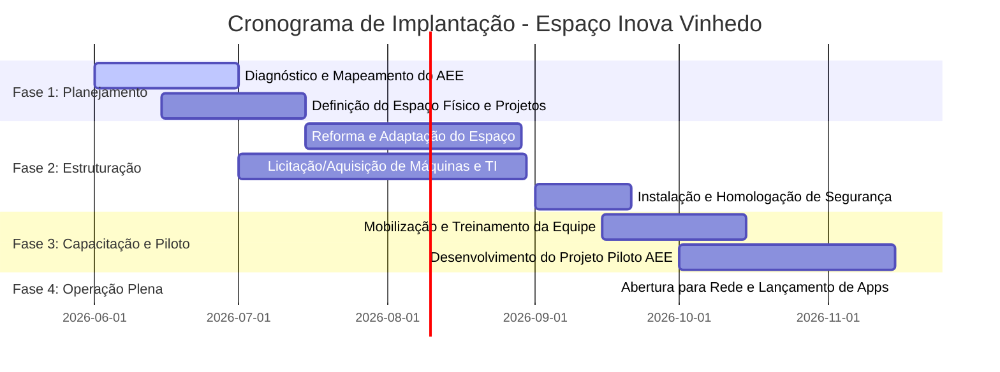

# Plano de Ação: Espaço Inova Vinhedo
## Laboratório Maker Municipal & Desenvolvimento de Soluções Customizadas

Este documento apresenta o Plano de Ação estruturado para a concepção, implantação e operação do **Espaço Inova Vinhedo**. A proposta consiste em criar um laboratório de inovação e fabricação digital (FabLab/Espaço Maker) e uma equipe ágil voltada para a criação de tecnologias assistivas e pequenos aplicativos para a rede municipal, priorizando o Atendimento Educacional Especializado (AEE).

---

## 1. Diretrizes da Política Pública

O Espaço Inova Vinhedo fundamenta-se nos princípios da **inclusão social, inovação aberta, eficiência administrativa e valorização do servidor público**. O principal objetivo é reduzir o tempo de resposta e o custo de adaptação no atendimento aos alunos com necessidades especiais da rede municipal, além de automatizar pequenos fluxos de trabalho das secretarias municipais que hoje dependem de longos processos licitatórios.

### Objetivos Estratégicos
*   **Acessibilidade e Inclusão Escolar:** Desenvolver recursos pedagógicos táteis e tecnologias assistivas personalizadas para alunos do AEE da rede municipal.
*   **Eficiência de Gestão Pública:** Desenvolver pequenos sistemas e aplicativos internos (TI local) para eliminar gargalos operacionais nas secretarias.
*   **Cultura de Inovação:** Capacitar servidores públicos na cultura maker, pensamento ágil e resolução de problemas focada no cidadão.

---

## 2. Características Gerais do Espaço Físico

Como o local definitivo ainda não foi estabelecido, definimos as diretrizes mínimas de infraestrutura física baseadas em normas de acessibilidade e fabricação digital:

| Requisito | Descrição | Justificativa Pedagógica/Técnica |
| :--- | :--- | :--- |
| **Acessibilidade Universal** | Rampa de acesso, portas com vão mínimo de 90cm, piso tátil e banheiros adaptados (conforme NBR 9050). | Essencial para o atendimento de alunos do AEE com mobilidade reduzida ou deficiências sensoriais. |
| **Estacionamento e Acesso** | Vagas exclusivas para PCD, área de embarque/desembarque segura e proximidade de linhas de transporte público. | Facilita a logística de visitas escolares e atendimento individualizado de famílias do AEE. |
| **Área Mínima** | Aproximadamente 80m² a 120m², divididos em: Zona de Sujeira (marcenaria/corte), Zona Limpa (TI/eletrônica) e Área de Reuniões/Apresentações. | Garantir a segurança dos usuários e a separação de resíduos de processos de fabricação. |
| **Rede Elétrica Dedicada** | Tensão bifásica ou trifásica (110V e 220V) com disjuntores específicos para o maquinário pesado (laser e fresadora). | Evitar quedas de energia e danos às placas eletrônicas e computadores durante o funcionamento das máquinas. |
| **Exaustão de Gases e Ventilação** | Sistema de exaustão forçada com saída externa de ar e filtros de carvão ativo para a cortadora a laser. | O corte de materiais como MDF e acrílico gera gases nocivos que não podem permanecer no ambiente interno. |
| **Iluminação e Acústica** | Janelas amplas com iluminação natural associada a luminárias LED de alta potência (500 lux nas bancadas) e tratamento acústico básico. | Fundamental para atividades de foco e programação, além de reduzir o impacto sonoro de serras e exaustores. |

---

## 3. Fases da Implantação (Cronograma Estimado: 8 Meses)



### Fase 1: Diagnóstico e Mapeamento (Mês 1 a Mês 2)
*   **Mapeamento de Necessidades do AEE:** Realizar reuniões com os professores de Educação Especial de Vinhedo para identificar os recursos pedagógicos mais demandados e de difícil aquisição no mercado (ex.: tabuleiros de comunicação alternativa, maquetes táteis, adaptadores de escrita).
*   **Prospecção do Imóvel:** Seleção do local físico atendendo aos requisitos mínimos de estacionamento, fácil acesso e infraestrutura elétrica/exaustão.

### Fase 2: Estruturação e Infraestrutura (Mês 2 a Mês 4)
*   **Reforma do Espaço:** Adaptações elétricas, hidráulicas e de exaustão.
*   **Aquisição do Maquinário:** Compra de impressoras 3D, cortadora a laser, ferramentas manuais e estações de trabalho através de ata de registro de preços ou pregão eletrônico.
*   **Adequação Normativa:** Vistoria técnica da prefeitura e corpo de bombeiros para garantir a conformidade do local.

### Fase 3: Capacitação da Equipe e Projeto Piloto (Mês 5 a Mês 6)
*   **Integração e Treinamento:** Treinamento prático da equipe municipal selecionada (escala de 4 servidores) na operação segura de cortadoras a laser, modelagem 3D (Tinkercad/Fusion 360), programação básica (Arduino/Javascript) e metodologia de codesign inclusivo.
*   **Projeto Piloto:** Produção de um lote inicial de 50 dispositivos assistivos para escolas específicas e validação prática em sala de aula de AEE.
*   **Primeira Automação de TI:** Lançamento de um aplicativo web simples para agendamento e triagem de atendimentos do AEE nas escolas de Vinhedo.

### Fase 4: Operação Plena (A partir do Mês 7)
*   **Atendimento Regular:** Agendamento de escolas e servidores municipais.
*   **Produção sob Demanda:** Fabricação contínua de recursos táteis sob solicitação do PEE das salas de recursos multifuncionais.
*   **Desenvolvimento de Soluções Municipais:** Identificação de fluxos burocráticos internos e desenvolvimento de pequenos aplicativos para mitigação de custos e otimização do tempo dos servidores.

---

## 4. Expansão do Atendimento Educacional Especializado (AEE)

Para além do fornecimento de dispositivos pontuais, o Espaço Inova Vinhedo funcionará como um centro de metodologias ativas maker aplicadas à educação inclusiva, promovendo a autonomia e o protagonismo dos estudantes por meio de diferentes formatos de engajamento:

### 4.1. Oficinas Temáticas Inclusivas (Média Duração: 4 a 12 semanas)
Estas oficinas são integradas ao plano de metas das salas de recursos multifuncionais das escolas de Vinhedo, com atendimentos semanais no contraturno escolar:
*   **Oficina de Robótica Adaptada e Autorregulação Sensorial (TEA):** Focada em alunos com Transtorno do Espectro Autista. Utiliza microcontroladores (Arduino) e componentes eletrônicos (como LEDs RGB, sensores de toque e motores) para construir dispositivos físicos de autorregulação e estímulo sensorial personalizado (ex: luminárias sensoriais interativas, caixas de som com feedback vibratório).
*   **Oficina de Cartografia Multissensorial (Deficiência Visual):** Alunos cegos ou com baixa visão utilizam a cortadora a laser e placas de MDF com relevos e texturas diferenciadas para criar e compreender mapas da sua escola, do município de Vinhedo e do relevo geográfico regional.
*   **Oficina de Comunicação Alternativa e Aumentativa (CAA):** Produção de tabuleiros de comunicação física e acoplamento de acionadores de baixo custo fabricados em impressão 3D para alunos com paralisia cerebral ou restrições severas na fala e motricidade fina.

### 4.2. Projetos Maker de Longa Duração (3 a 6 meses)
Iniciativas estruturadas voltadas para o desenvolvimento de recursos pedagógicos avançados e de adaptação escolar de uso cotidiano (não clínico):
*   **Projeto Codesign de Objetos Auxiliares de Apoio Pedagógico:** Ciclo de desenvolvimento participativo focado em criar e adaptar objetos cotidianos de apoio escolar de baixo risco (como engrossadores de lápis adaptados, acionadores mecânicos de mesa, adaptadores ergonômicos de tesouras e suportes ajustáveis de leitura). Foca na autonomia em sala de aula de recursos multifuncionais do AEE. A fabricação de órteses terapêuticas sob medida (dispositivos de saúde) está alocada no Plano de Expansão (Fase 2, a partir do mês 13), após estruturação de convênio com a rede de saúde e indicação de responsável clínico.
*   **Projeto Laboratórios de Ciências Descentralizados e Móveis:** Desenvolvimento de kits didáticos de física, química, biologia e matemática (ex.: conjuntos de engrenagens de MDF cortadas a laser, blocos geométricos tridimensionais, kits experimentais de polias e modelos táteis de células) atuando como suporte pedagógico auxiliar para as escolas municipais enquanto laboratórios físicos permanentes são estruturados ou construídos, promovendo o engajamento científico inicial.
*   **Projeto Jovem Inventor Inclusivo:** Voltado para estudantes do ensino fundamental II da rede pública. Alunos neurotípicos e alunos do AEE trabalham em duplas no laboratório ao longo de um semestre letivo. O objetivo é desafiá-los a identificar barreiras de acessibilidade na sua própria escola e projetar e construir uma solução maker para resolvê-las, desenvolvendo habilidades de empatia, design universal, modelagem 3D e eletrônica.

### 4.3. Projetos Associados de Alto Impacto
*   **Kit de Alfabetização Tátil e Fonética Municipal:** Projeto institucional focado na fabricação em escala (usando cortadora a laser e impressoras 3D) de um kit pedagógico estruturado de alfabetização fonética multissensorial para ser distribuído em 100% das salas de recursos do AEE de Vinhedo, substituindo recursos importados de alto custo.
*   **Rede Municipal de Tecnologia Assistiva Livre:** Criação de um repositório web municipal aberto contendo todos os modelos CAD (arquivos STL e DXF) desenvolvidos no laboratório. Qualquer escola do Brasil, professor ou família poderá fazer o download gratuito e fabricar localmente as soluções desenvolvidas em Vinhedo, gerando relevância nacional para o ecossistema de inovação da cidade.

---

## 5. Ecossistema de Prototipagem de Software com IA (Custo Próximo a Zero)

Além da fabricação digital de objetos físicos, o Espaço Inova Vinhedo institui um pilar de desenvolvimento ágil de softwares e aplicativos baseado em Inteligência Artificial Generativa e em metodologias de *Vibecoding* (programação por meio de linguagem natural). Esse ecossistema permite resolver demandas de automação administrativa e pedagógica de forma imediata e sem consumo de insumos físicos.

### 5.1. Abordagem de Desenvolvimento Ágil e Baixa Fricção
A equipe de TI alocada e os docentes utilizam assistentes de código e plataformas no-code/serverless (como chaves de API do Gemini, Cursor, IDX e Firebase) para projetar e testar micro-soluções digitais. Os protótipos são criados em ciclos de 15 dias letivos (Sprints).
Para iniciar com baixa fricção e entregas rápidas na Fase 1-A (primeiros 30 dias), as seguintes micro-soluções serão colocadas em funcionamento:
1.  **Sistema de Agendamento Inteligente:** Aplicação web para reserva de horários do laboratório maker e das salas de recursos multifuncionais do AEE pelas escolas.
2.  **App de Inventário e Logística de Maletas Didáticas:** Sistema simples para gerenciar a distribuição, datas de empréstimo e condições dos Kits Didáticos Móveis de Ciências enviados às escolas.
3.  **Registro de Evolução Individual (PEI Digital):** Prontuário pedagógico simplificado para preenchimento de relatos de autonomia escolar dos alunos atendidos, com gráficos de tempo de foco.
4.  **Automações de Fluxo de Trabalho (Google Apps Script):** Robôs para disparo automático de avisos de devolução de materiais didáticos e lembretes de reuniões de HTPC via WhatsApp/e-mail para os professores.

### 5.2. Programa de Oficinas Temáticas de Tecnologia e IA
As oficinas unem tecnologia digital, pensamento computacional e letramento tecnológico, alinhadas às diretrizes da Base Nacional Comum Curricular (BNCC):
*   **Oficina de Vibecoding e Soluções Cívicas (Alunos - Contraturno):** Estudantes do Ensino Fundamental II aprendem a conceber aplicações web utilizando chaves de API de IA generativa para resolver problemas do cotidiano escolar (ex: aplicativos de reciclagem de resíduos sólidos, calculadoras científicas interativas).
    *   *Alinhamento com a BNCC:* Contribui diretamente para a **Competência Geral 5 (Cultura Digital)** e **Competência Geral 7 (Argumentação)**, ao capacitar o aluno a usar tecnologias para se comunicar, processar informações e criar soluções de forma ética e ativa.
*   **Oficina de Letramento Digital e Produtividade com IA (Professores - HTPC):** Capacitação de professores da rede municipal na elaboração de prompts assertivos para o planejamento de aulas de ciências, geração de bancos de exercícios personalizados e otimização de relatórios escolares no contraturno.
    *   *Mecanismo de Inclusão:* O foco é diminuir o trabalho mecânico dos docentes, dando-lhes mais tempo para o acompanhamento personalizado de alunos do AEE.

### 5.3. Infraestrutura e Requisitos de Software
Para colocar o ecossistema digital em funcionamento, são estabelecidos os seguintes requisitos:
*   **Acesso à Internet Dedicada:** Rede corporativa com link dedicado para acesso às APIs de desenvolvimento em nuvem.
*   **Chaves de API e Contas de Desenvolvimento:** Criação de uma conta institucional do município sob a *Google Cloud Organization* para obtenção das credenciais gratuitas ou de cunho educacional da API do Gemini.
*   **Ambiente Local:** Configuração de IDEs livres (VS Code, IDX) e SDKs nos 4 terminais de trabalho do laboratório.

---

## 6. Matriz de Governança e Papéis

O sucesso do projeto depende da integração transversal entre diferentes pastas da Prefeitura de Vinhedo:

```
                  ┌─────────────────────────────────────┐
                  │      Secretaria de Educação         │
                  │ (Gestão Pedagógica, AEE e Alunos)   │
                  └──────────────────┬──────────────────┘
                                     │
                  ┌──────────────────┴──────────────────┐
                  │       ESPAÇO INOVA VINHEDO          │
                  │   (Equipe e Laboratório Maker)      │
                  └──────────────────┬──────────────────┘
                                     │
           ┌─────────────────────────┴─────────────────────────┐
           ▼                                                   ▼
┌─────────────────────────────────────┐             ┌─────────────────────────────────────┐
│  Sec. de Administração e Tecnologia  │             │  Secretaria de Desenvolvimento Ec.  │
│ (Infraestrutura de TI e Sistemas)   │             │ (Integração com SEBRAE / Negócios)  │
└─────────────────────────────────────┘             └─────────────────────────────────────┘
```

1.  **Secretaria Municipal de Educação (SME):**
    *   Fornecer as diretrizes pedagógicas para as tecnologias assistivas desenvolvidas.
    *   Disponibilizar os profissionais de AEE para compor o corpo técnico do Espaço.
    *   Coordenar o cronograma de visitas das escolas da rede municipal.
2.  **Secretaria Municipal de Administração e Tecnologia:**
    *   Supervisionar o desenvolvimento de aplicativos internos, garantindo a integração com a infraestrutura de TI existente e o cumprimento da LGPD.
    *   Prestar suporte na infraestrutura de rede, servidores municipais e segurança lógica do espaço.
3.  **Secretaria Municipal de Desenvolvimento Econômico (SMDE):**
    *   Articular parcerias externas com o SEBRAE, indústrias do distrito industrial de Vinhedo e centros universitários (como Unicamp e IFSP).
    *   Fomentar programas de incubação para soluções nascidas no laboratório que tenham potencial de mercado.

---

## 7. Plano de Engajamento, Comunicação e Logística Reversa

A sustentabilidade do laboratório maker e a atração contínua de demandas reais dependem de um plano de comunicação ativa nas escolas e de uma articulação estruturada de fornecimento de insumos com o setor privado de Vinhedo.

### 7.1. Campanhas de Comunicação e Engajamento na Rede Municipal
Para evitar a subutilização do espaço e garantir que os professores de AEE e de regência comum se apropriem do laboratório, institui-se o seguinte cronograma de difusão:
*   **Visitas Obrigatórias de Planejamento (HTPCs):** Os Coordenadores Pedagógicos de todas as escolas municipais de Vinhedo farão visitas de planejamento integradas aos seus Horários de Trabalho Pedagógico Coletivo (HTPCs) ao menos uma vez por semestre no Espaço Inova, mapeando gargalos das salas de aula comuns que podem ser resolvidos pelo laboratório.
*   **Workshops Itinerantes "Minuto Inclusivo":** A equipe do Espaço Inova realizará oficinas rápidas nas reuniões pedagógicas das escolas para expor e demonstrar o funcionamento prático de adaptadores ergonômicos e jogos pedagógicos táteis desenvolvidos no espaço.
*   **Canal Direto de Demanda:** Criação de um formulário simplificado no portal da Secretaria de Educação para solicitação direta de pequenos recursos pedagógicos ou agendamento de casos complexos para codesign.

### 7.2. Fluxo Jurídico e Operacional da Logística Reversa de Insumos e Materiais
Para otimizar os custos com insumos e promover a sustentabilidade, o laboratório maker combinará a aquisição de matérias-primas novas e acessíveis com um fluxo estruturado de aproveitamento e logística reversa de retalhos e sobras limpas de MDF e acrílico fornecidas pelas indústrias locais de Vinhedo, garantindo que os kits didáticos utilizem materiais duráveis e de qualidade adequada:

```
┌────────────────────────────────────────────────────────────────────────┐
│             FLUXO DE LOGÍSTICA REVERSA DE INSUMOS                      │
├────────────────────────────────────────────────────────────────────────┤
│ 1. Identificação de Sobras: Indústria do Distrito Industrial de        │
│    Vinhedo separa sobras e retalhos utilizáveis de MDF e acrílico.    │
├────────────────────────────────────────────────────────────────────────┤
│ 2. Emissão Fiscal: Empresa emite Nota Fiscal de Baixa de Ativo ou      │
│    Doação de Resíduos Sólidos sob CFOP específico (isenção de ICMS).   │
├────────────────────────────────────────────────────────────────────────┤
│ 3. Recebimento da Prefeitura: SME emite o Termo de Recebimento de      │
│    Doação de Materiais, incorporando os insumos ao inventário local.   │
├────────────────────────────────────────────────────────────────────────┤
│ 4. Selo de Parceria: Município outorga o selo "Empresa Parceira da     │
│    Inclusão" para uso reputacional nas marcas privadas.               │
└────────────────────────────────────────────────────────────────────────┘
```

*   **O Selo "Empresa Parceira da Inclusão":** Instituído por decreto municipal, este selo será outorgado anualmente às empresas do distrito industrial que fornecerem metas de insumos a custo zero para o laboratório. A certificação poderá ser explorada comercialmente pelas marcas como selo de responsabilidade socioambiental (ESG) e acessibilidade, estimulando a responsabilidade social do setor industrial de Vinhedo.

